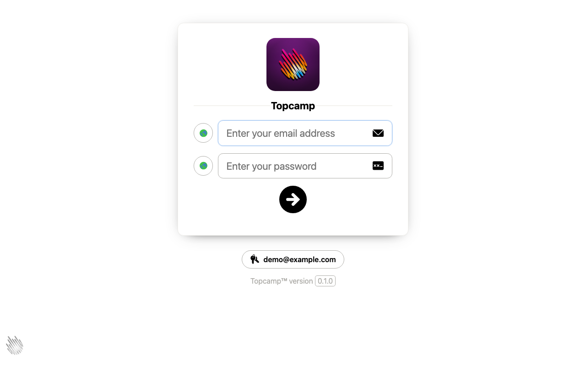
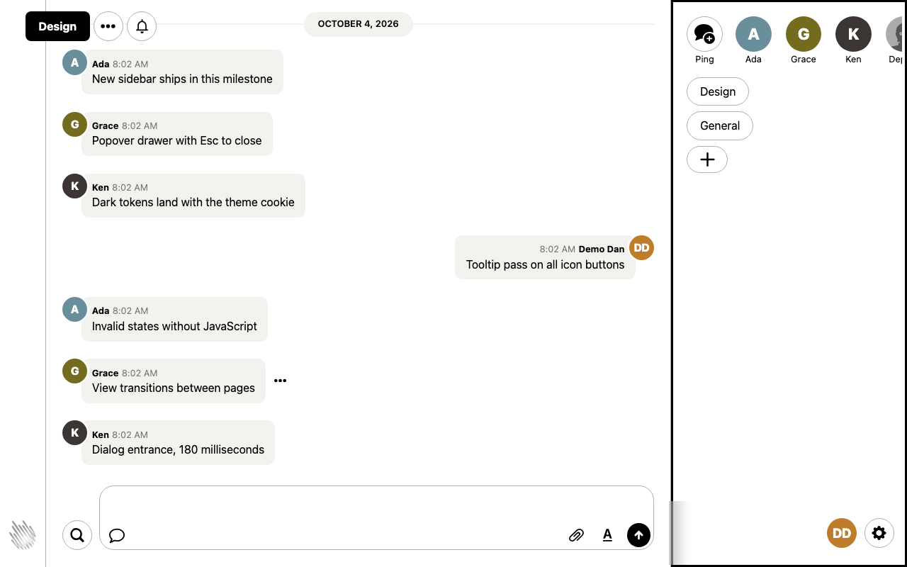
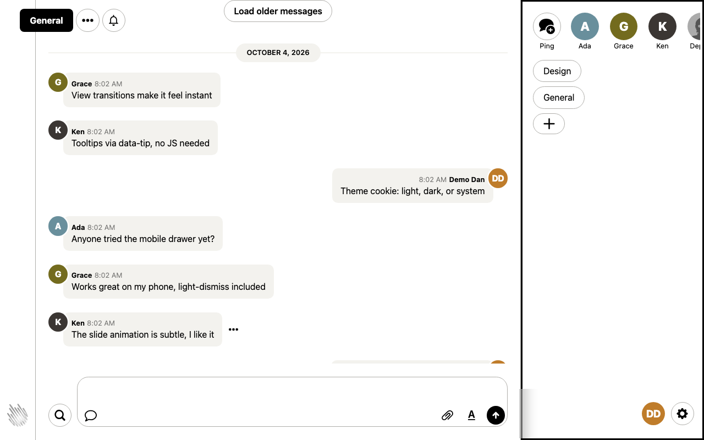
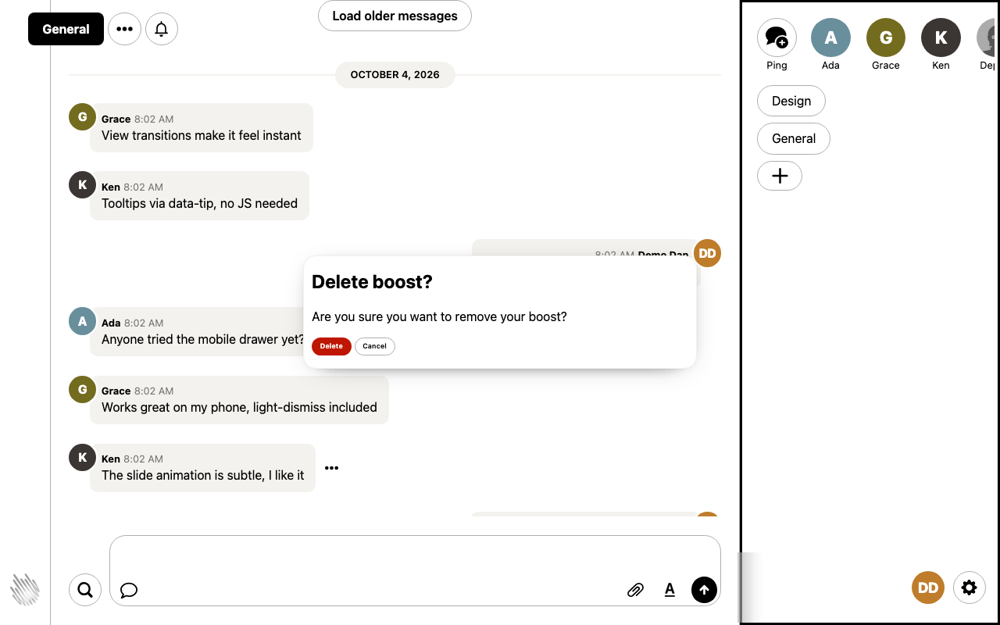
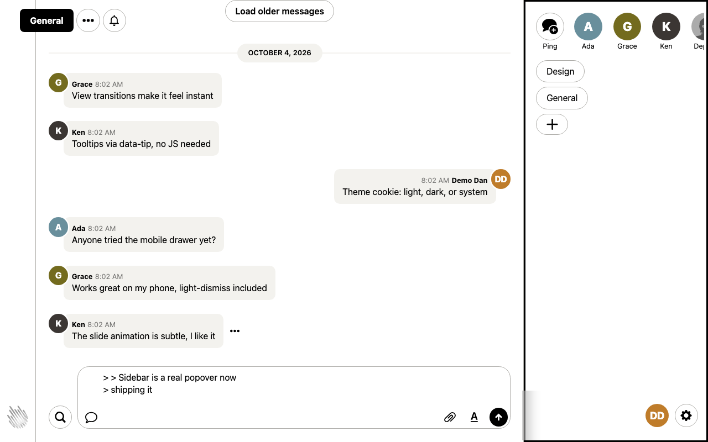
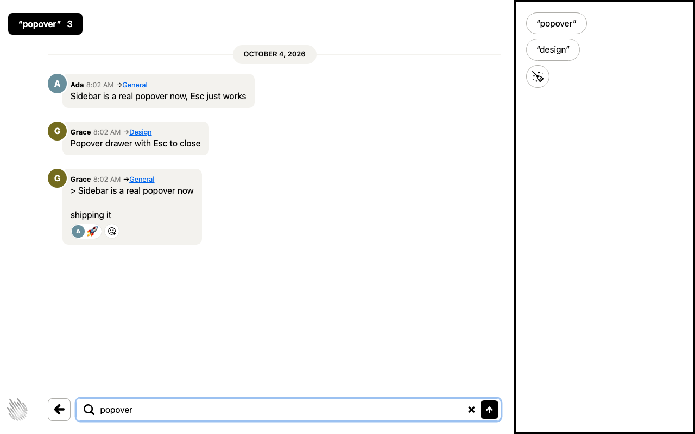
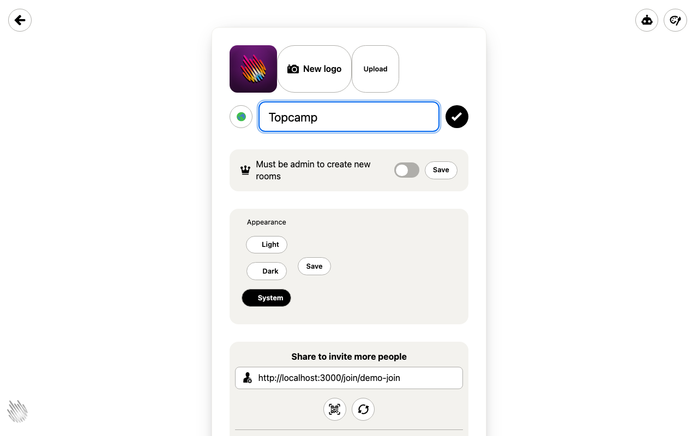
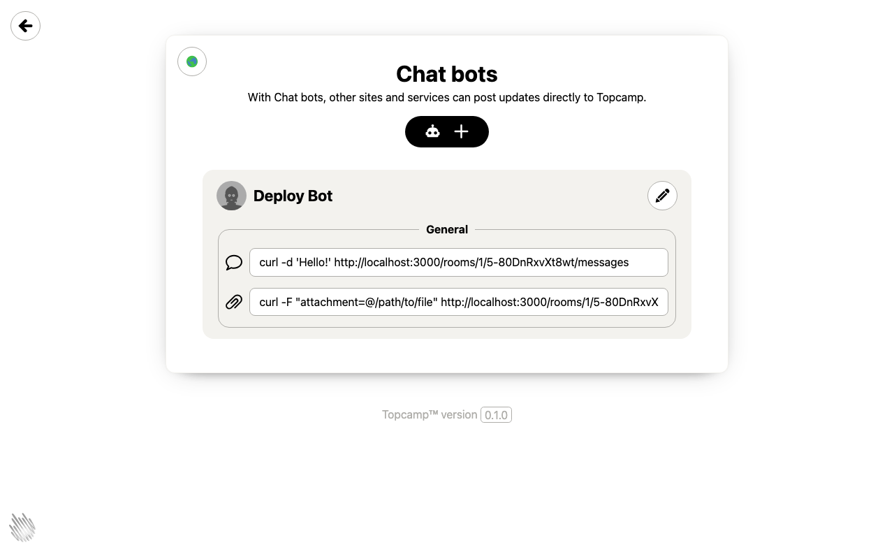

# Topcamp

Topcamp is a slopfork of `basecamp/once-campfire-rust` (the 37signals
Campfire Rust port), rebuilt on the [Topcoat](https://docs.rs/topcoat)
web framework with PostgreSQL + DBOS + RustFS. Same product, new stack:
Topcoat router/layers/session at the HTTP boundary, `live!`/`procedure`
regions instead of Turbo/Stimulus, and zero hand-written JavaScript.

The running experiment is how far Topcoat goes natively: server-rendered
`<dialog>` confirms (`?confirm=`), reply prefill (`?reply_to=`), history
paging (`?before=`), multipart attachment posts, a popover mobile drawer,
and a cookie theme — all markup + CSS. Details in [TASKS-UI.md](TASKS-UI.md);
demo data via `cargo run -p topcamp-web --bin seed`.

Migration spec: [Instruction.md](Instruction.md).

## Screenshots

Demo data via `cargo run -p topcamp-web --bin seed`, captured with
headless Chromium (see [docs/shots/capture.py](docs/shots/capture.py)):

| Sign in | Design room | General room |
| ------- | ----------- | ------------ |
|  |  |  |

| Delete confirm (`?confirm=`) | Reply prefill (`?reply_to=`) | Search |
| ---------------------------- | ---------------------------- | ------ |
|  |  |  |

| Account settings + theme cookie | Chat bots |
| ------------------------------- | --------- |
|  |  |

## Artifacts

| File | Purpose |
| ---- | ------- |
| [Instruction.md](Instruction.md) | The migration specification (58 sections) |
| [TASKS.md](TASKS.md) | Human-readable task tracking: 66 tasks across 6 phases |
| [tasks.json](tasks.json) | Machine-readable mirror of TASKS.md (for tooling/publishing) |
| [MIGRATION_NOTES.md](MIGRATION_NOTES.md) | Audit evidence + designs: traces, pins, schema plan, app-layer/DBOS/config plans |
| [migrations/](migrations/) | PostgreSQL migrations (`0001_init` … `0005_cable_fanout`), apply in order to `$DATABASE_URL` |
| [.env.example](.env.example) | Documented configuration template (no secrets) |
| [compose.yml](compose.yml) | Local PostgreSQL 17 + RustFS 1.0 for development and tests |
| [crates/topcamp-domain](crates/topcamp-domain) | Dependency-free domain crate (errors, auth, rooms, search) — 29 tests |
| [crates/topcamp-db](crates/topcamp-db) | sqlx 0.9 repositories (`PgDb`) + transactional outbox + `post_message` atomic use case — 14 tests |
| [crates/topcamp-storage](crates/topcamp-storage) | S3-compatible blob store over RustFS — 5 live tests |
| [crates/topcamp-web](crates/topcamp-web) | Topcoat 0.9 routes, upstream-parity pages over vendored design CSS, cookie+session layers, request-ID layer, `/cable` mount — 35 tests |
| [TASKS-UI.md](TASKS-UI.md) | UI/UX parity program vs upstream (routes, pages, behavior), tracked per slice |
| [crates/topcamp-workflows](crates/topcamp-workflows) | 5 DBOS 0.5 workflows + outbox relay + worker binary — 22 tests |
| [crates/topcamp-cable](crates/topcamp-cable) | Action Cable frame codec + stream naming + broadcast broker — 18 tests |
| [TRACES_SUPPLEMENT.md](TRACES_SUPPLEMENT.md) | Gap traces: edge server, assets, cable turbo/naming, password/IDs |

## Status

66/66 tasks done (TASKS.md + tasks.json agree). All gates green:
`cargo fmt --check`, `cargo clippy --all-targets` (zero warnings),
`cargo test --workspace` (120 passed, 0 failed, incl. live DBOS,
`/cable` WebSocket end-to-end, and storage tests against compose.yml
services). Final architecture review (§55) and definition of done (§56)
pass; see TASKS.md evidence pointers.

Known limitation (documented, out of scope): WebPush payload
encryption (RFC 8291) is not implemented — push POSTs carry plaintext
JSON and require TLS endpoints.

## Local development

```sh
cp .env.example .env   # fill in secrets (never commit .env)
docker compose up -d   # PostgreSQL 17 + RustFS 1.0
for m in migrations/*.sql; do
  psql "$DATABASE_URL" -v ON_ERROR_STOP=1 -f "$m"
done
cargo build -p topcamp-web --bin serve
topcoat asset bundle --bin serve -p topcamp-web   # stylesheet + fonts
# (no `topcoat` CLI here? `cargo run -p topcamp-web --bin bundle_assets`)
PORT=3000 cargo run -p topcamp-web --bin serve    # HTTP + /cable
cargo run -p topcamp-workflows --bin worker       # DBOS + outbox relay
cargo test --workspace                             # full suite (needs services up)
```

Tests self-bundle web assets at runtime, so `cargo test` needs no
prebuilt bundle; only `serve` needs the `topcoat asset bundle` step.

## Contributing

Start with [AGENTS.md](AGENTS.md) — project motto, toolchain, gates,
database hygiene, and the no-JS UI contract. Two project skills carry
the details agents need: `topcoat-nojs` (zero-JS UI recipes) and
`topcamp-verify` (the exact verify loop), both under
[.agents/skills/](.agents/skills/). The story behind the decisions —
Turbo removal, the dialog iteration, the screenshot bug hunt — is in
[docs/SESSION_LOG.md](docs/SESSION_LOG.md).

## Implementation status

- `topcamp-domain`: pure rules, zero dependencies; 29 tests green.
- `topcamp-db`: full `PgDb` repositories + outbox claim/release +
  webhook-delivery claims; shared stderr logging init; 1 unit + 13 live
  tests green.
- `topcamp-storage`: `S3BlobStore` (put/get/head/delete) with
  key-only tracing spans; 5 live tests green against RustFS.
- `topcamp-web`: Topcoat 0.9 routes (rooms/messages/search/session),
  upstream-parity sign-in (`GET /session/new`, `POST`+`DELETE /session`,
  rate limit, rejection flash) over vendored design CSS, cookie+session
  layers, request-ID layer with `x-request-id` echo, domain→HTTP error
  mapping, `/cable` mount (auth → welcome → ping/confirm/reject/
  broadcast/disconnect), worker→web LISTEN bridge; 28 unit + 6 live +
  1 `/cable` end-to-end tests green. Remaining page parity: TASKS-UI.md.
- `topcamp-workflows`: purge/attachment/notification/webhook/
  moderation workflows with recorded steps, idempotency keys, and
  outcome logging; outbox relay (`SKIP LOCKED` claims, durable-then-
  broadcast); worker binary (DBOS executor + relay loop); 10 unit +
  12 live DBOS tests green.
- `topcamp-cable`: protocol codec, channel parsing, stream naming,
  broadcast broker, connection registry; 18 tests green.

## Toolchain

Requires rustc ≥ 1.98 (Topcoat 0.10) via rustup stable, plus the
`topcoat` CLI (`cargo install topcoat --version 0.10`) for the asset
bundle step. Services come from compose.yml (or any PostgreSQL 17 +
S3-compatible store matching `.env.example`).
